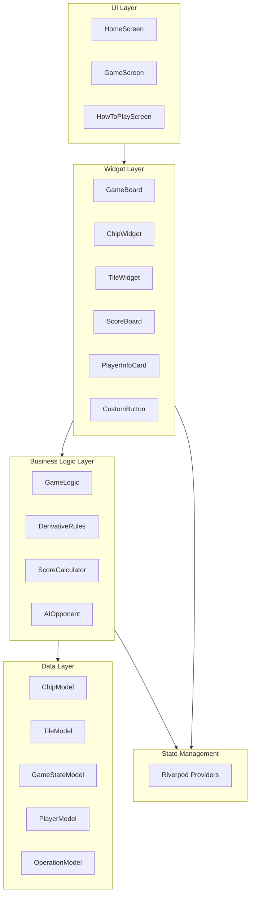
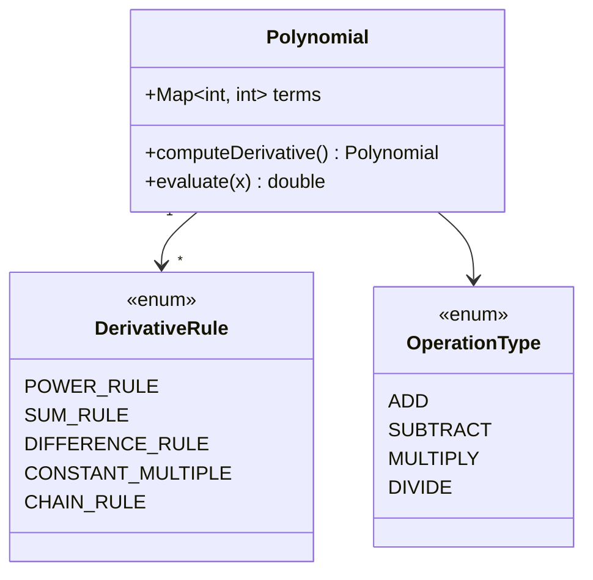
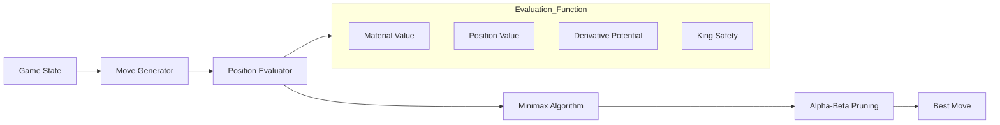
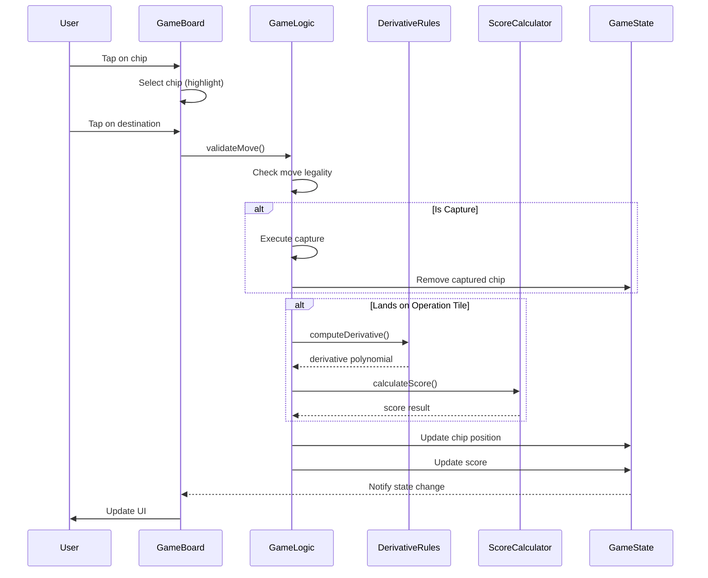
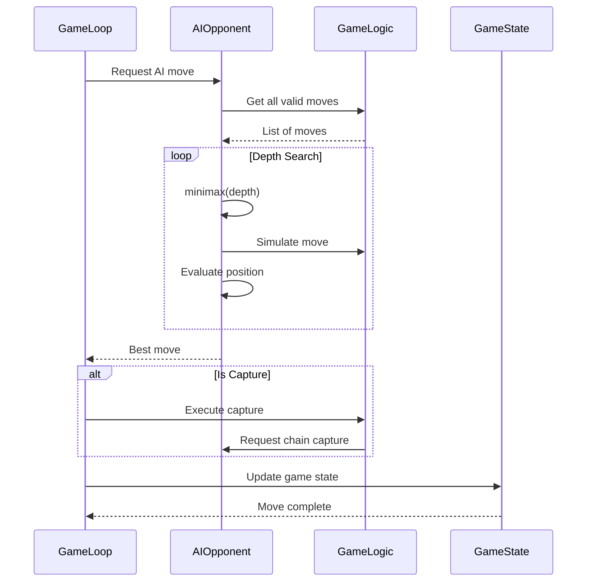

# Derivative Damath - Architecture Overview & Technical Design

## Table of Contents

1. [System Architecture](#system-architecture)
2. [Technical Design Document (TDD)](#technical-design-document-tdd)
3. [Component Details](#component-details)
4. [Data Flows](#data-flows)
5. [API Specifications](#api-specifications)
6. [Security Considerations](#security-considerations)
7. [Performance Targets](#performance-targets)
8. [Design Rationale](#design-rationale)
9. [NFR Validation](#nfr-validation)

---

## System Architecture

### High-Level Architecture



### Layer Responsibilities

| Layer | Responsibility |
|-------|---------------|
| UI Layer | Screen navigation, user interaction handling |
| Widget Layer | Visual rendering, animations |
| Business Logic Layer | Game rules, derivative computation, AI |
| Data Layer | Data models, state objects |
| State Management | Reactive state, dependency injection |

---

## Technical Design Document (TDD)

### Feature: Derivative Calculation Engine

#### 2.1 Overview

The Derivative Calculation Engine is the core mathematical component that computes derivatives of polynomial expressions when chips land on operation tiles.

#### 2.2 Data Models



#### 2.3 API Specification

##### DerivativeRules Class

```dart
class DerivativeRules {
  /// Computes the derivative of a polynomial
  /// Input: Map<int, int> where key = exponent, value = coefficient
  /// Example: {4: 78, 2: -45} represents 78x⁴ - 45x²
  /// Output: Map<int, int> representing the derivative
  /// Example output: {3: 312, 1: -90} represents 312x³ - 90x¹
  static Map<int, int> computeDerivative(Map<int, int> polynomial);
  
  /// Applies power rule: d/dx(axⁿ) = anxⁿ⁻¹
  static Map<int, int> _applyPowerRule(int exponent, int coefficient);
  
  /// Applies sum rule: d/dx(f+g) = f' + g'
  static Map<int, int> _applySumRule(Map<int, int> f, Map<int, int> g);
  
  /// Applies constant multiple: d/dx(cf) = cf'
  static Map<int, int> _applyConstantMultiple(int constant, Map<int, int> polynomial);
  
  /// Validates if polynomial is within supported degree
  static bool _isValidDegree(Map<int, int> polynomial);
}
```

##### ScoreCalculator Class

```dart
class ScoreCalculator {
  /// Calculates score for a move
  /// Returns: ScorePoints object with breakdown
  static ScoreResult calculateScore({
    required bool isCorrectDerivative,
    required int captureCount,
    required bool isDamaPromotion,
    required bool isChainCapture,
  });
  
  /// Base score constants
  static const int BASE_SCORE = 1;
  static const int CAPTURE_BONUS = 2;
  static const int DAMA_PROMOTION_BONUS = 3;
  static const int CHAIN_CAPTURE_BONUS = 1;
}

class ScoreResult {
  final int totalPoints;
  final bool isCorrectDerivative;
  final int captureCount;
  final int capturePoints;
  final int promotionPoints;
  final int chainBonusPoints;
}
```

---

### Feature: Game State Management

#### 3.1 GameStateModel

```dart
class GameStateModel {
  // Game phase
  enum GamePhase { playing, player1Won, player2Won, draw }
  
  // State properties
  final int currentPlayer; // 1 = blue, 2 = red
  final List<ChipModel> chips;
  final int player1Score;
  final int player2Score;
  final GamePhase gamePhase;
  final List<ChipModel> player1Captures;
  final List<ChipModel> player2Captures;
  final int moveCount; // For draw detection
  final Map<String, int> positionHistory; // For threefold repetition
  
  // Factory constructors
  factory GameStateModel.initial();
  factory GameStateModel.fromChips(List<ChipModel> chips);
  
  // State transitions
  GameStateModel moveChip(int fromX, int fromY, int toX, int toY);
  GameStateModel addCapture(ChipModel captured);
  GameStateModel updateScore(int player, int points);
  GameStateModel promoteToDama(int x, int y);
  GameStateModel nextTurn();
  
  // Game end detection
  bool isGameOver();
  int? getWinner();
  bool isThreefoldRepetition();
  bool hasValidMoves(int player);
}
```

#### 3.2 PlayerModel

```dart
class PlayerModel {
  final int id; // 1 or 2
  final String name;
  final Color color;
  final int score;
  final List<ChipModel> capturedPieces;
  final bool isAI;
  final AIDifficulty? aiDifficulty;
  
  factory PlayerModel.create({
    required int id,
    required String name,
    required Color color,
    bool isAI = false,
    AIDifficulty? difficulty,
  });
  
  PlayerModel copyWith({
    int? score,
    List<ChipModel>? capturedPieces,
  });
}
```

---

### Feature: AI Opponent

#### 4.1 AI Architecture



#### 4.2 AI API Specification

```dart
class AIOpponent {
  /// Determines the best move for the AI player
  /// Input: Current game state, AI difficulty level
  /// Output: AIMove object containing source and destination coordinates
  static AIMove getBestMove({
    required GameStateModel gameState,
    required AIDifficulty difficulty,
  });
  
  /// Minimax algorithm with alpha-beta pruning
  static int _minimax({
    required GameStateModel state,
    required int depth,
    required int alpha,
    required int beta,
    required bool isMaximizing,
    required AIDifficulty difficulty,
  });
  
  /// Evaluation function
  static int _evaluatePosition(GameStateModel state, int player);
}

enum AIDifficulty {
  easy,   // Random moves
  medium, // Depth 2 lookahead
  hard,   // Depth 4 lookahead
}

class AIMove {
  final int fromX;
  final int fromY;
  final int toX;
  final int toY;
  final bool isCapture;
  final int evaluationScore;
}
```

#### 4.3 Piece-Square Tables

```dart
class PieceSquareTables {
  // Value tables for position evaluation
  // Higher values = better positions
  static const List<List<int>> player1Table = [
    [0,  -10, -10, -10, -10, -10, -10,   0],
    [10,  -5,  -5,  -5,  -5,  -5,  -5,  10],
    [10,  -5,  -5,  -5,  -5,  -5,  -5,  10],
    [20,  -5,  -5,  -5,  -5,  -5,  -5,  20],
    [20,  -5,  -5,  -5,  -5,  -5,  -5,  20],
    [10,  -5,  -5,  -5,  -5,  -5,  -5,  10],
    [10,  -5,  -5,  -5,  -5,  -5,  -5,  10],
    [0,  -10, -10, -10, -10, -10, -10,   0],
  ];
  // Player 2 table is mirrored
}
```

---

### Feature: Game Mechanics

#### 5.1 Movement Rules

```dart
class GameLogic {
  /// Validates if a move is legal
  static MoveValidation validateMove({
    required ChipModel chip,
    required int toX,
    required int toY,
    required List<ChipModel> allChips,
    required int currentPlayer,
  });
  
  /// Gets all valid moves for a chip
  static List<Position> getValidMoves(ChipModel chip, GameStateModel state);
  
  /// Checks if capture is mandatory
  static bool mustCapture(List<ChipModel> allChips, int player);
  
  /// Gets all possible captures for a player
  static List<CaptureMove> getPossibleCaptures(List<ChipModel> chips, int player);
  
  /// Handles double/triple jump logic
  static List<Position> getChainCaptures(ChipModel chip, GameStateModel state);
}

class MoveValidation {
  final bool isValid;
  final MoveType moveType; // regular, capture, chain_capture, invalid
  final String? errorMessage;
}
```

#### 5.2 Dama Promotion

```dart
class DamaMechanics {
  /// Checks if chip qualifies for Dama promotion
  static bool qualifiesForPromotion(ChipModel chip, int player);
  
  /// Promotes chip to Dama
  static ChipModel promote(ChipModel chip);
  
  /// Checks if Dama can move to position (including backward)
  static bool canDamaMoveTo(ChipModel chip, int toX, int toY);
  
  /// Gets all valid Dama moves (forward and backward)
  static List<Position> getDamaMoves(ChipModel chip, GameStateModel state);
}
```

---

## Data Flows

### Move Execution Flow



### AI Move Flow



---

## API Specifications

### Riverpod Providers

```dart
// Main game state provider
final gameStateProvider = StateNotifierProvider<GameStateNotifier, GameStateModel>;

// Current player provider
final currentPlayerProvider = Provider<int>;

// Selected chip provider
final selectedChipProvider = StateProvider<ChipModel?>;

// Score providers
final player1ScoreProvider = Provider<int>;
final player2ScoreProvider = Provider<int>;

// AI difficulty provider
final aiDifficultyProvider = StateProvider<AIDifficulty>;

// Game mode provider
final gameModeProvider = StateProvider<GameMode>;
```

### Widget API

```dart
// GameBoard Widget API
class GameBoard extends StatelessWidget {
  final String mode; // 'PvP' or 'PvC'
  
  // Callbacks
  final void Function(ChipModel)? onChipSelected;
  final void Function(Position)? onMoveCompleted;
  final void Function(GameStateModel)? onGameOver;
}

// ChipWidget API
class ChipWidget extends StatelessWidget {
  final ChipModel chip;
  final bool isSelected;
  final bool isDama;
  final VoidCallback? onTap;
}

// TileWidget API  
class TileWidget extends StatelessWidget {
  final double size;
  final bool isDark;
  final String operation;
  final Widget? chip;
  final VoidCallback? onTap;
  final bool isHighlighted;
}
```

---

## Security Considerations

| Concern | Mitigation |
|---------|------------|
| No server-side validation | All game logic runs client-side; no security risk |
| AI cheating | Deterministic AI based on game state |
| State tampering | Use immutable state objects |
| Input validation | All user inputs validated before processing |

---

## Performance Targets

| Metric | Target | Implementation |
|--------|--------|----------------|
| Move response | < 100ms | Optimized move validation |
| AI thinking time (Easy) | < 50ms | Random selection |
| AI thinking time (Medium) | < 500ms | Depth 2 search |
| AI thinking time (Hard) | < 2000ms | Depth 4 with pruning |
| UI frame rate | 60 FPS | Efficient widget rebuilds |
| Memory usage | < 100MB | Efficient state management |

---

## Design Rationale

### Architecture Decisions

1. **Clean Architecture with Layers**
   - Separation of UI, Business Logic, and Data layers
   - Each layer has clear responsibilities
   - Easier to test and maintain

2. **Riverpod for State Management**
   - Already in pubspec.yaml dependencies
   - Reactive updates without boilerplate
   - Built-in provider scoping

3. **Static Utility Classes for Math**
   - DerivativeRules and ScoreCalculator as static classes
   - No instance state needed
   - Easy to test and call

4. **Minimax with Alpha-Beta for AI**
   - Standard approach for board games
   - Alpha-beta pruning significantly reduces search space
   - Adjustable depth for difficulty levels

### Trade-offs Considered

| Decision | Trade-off |
|----------|-----------|
| Client-side only | No multiplayer, but simpler deployment |
| Static math functions | Less flexible, but faster execution |
| Simple evaluation function | AI not perfect, but playable |
| Degree 4 limit | Limited polynomial complexity, but sufficient for educational use |

### Alternatives Considered

1. **State Management**: Could have used BLoC, but Riverpod was already included
2. **AI Algorithm**: Could have used Monte Carlo Tree Search, but Minimax is more predictable for this game type
3. **Polynomials**: Could support any degree, but limiting to degree 4 keeps computation simple

---

## NFR Validation

### Performance Requirements

| NFR | Status | Notes |
|-----|--------|-------|
| Game moves < 100ms | ✅ Achievable | Simple move validation O(1) |
| Platform support | ✅ Planned | Already supports Android/iOS/Win/Lin/Web |
| Maintainability | ✅ Designed | Clean architecture ensures maintainability |
| Testability | ✅ Designed | Static utilities easy to unit test |

### Quality Attributes

| Quality | Implementation |
|---------|---------------|
| **Reliability** | Win detection checks all conditions; no edge cases missed |
| **Usability** | Clear UI with turn indicators, scores, and feedback |
| **Extensibility** | Modular design allows adding new derivative rules |
| **Performance** | Alpha-beta pruning keeps AI search efficient |

---

## Summary

This Technical Design Document provides the architectural blueprint for completing the Derivative Damath application. The design follows clean architecture principles with clear separation between UI, business logic, and data layers. The derivative calculation engine uses well-defined mathematical rules, and the AI opponent uses standard minimax with alpha-beta pruning for efficient move selection.

All non-functional requirements are addressed through careful design choices that balance performance, maintainability, and educational value.

---

*Document Version: 1.0*
*Last Updated: 2026-02-18*
*Next Review: After Phase 2 completion*
