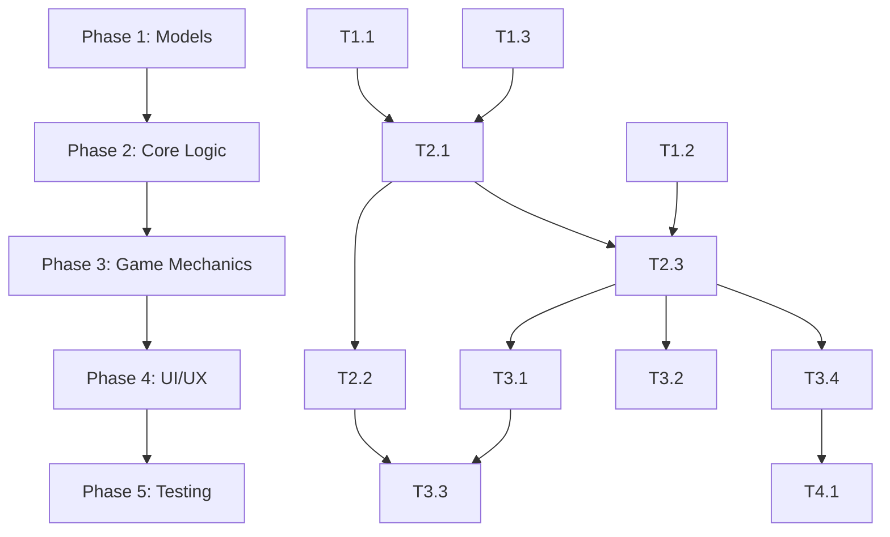

# Implementation Plan - Derivative Damath

## Overview
This document outlines the phased implementation plan to complete the remaining ~55-60% of the Derivative Damath project.

---

## Phase Breakdown

| Phase | Name | Description | Est. Completion |
|-------|------|-------------|-----------------|
| 1 | Foundation | Complete empty models | 10% |
| 2 | Core Logic | Derivative engine + scoring | 20% |
| 3 | Game Mechanics | Advanced moves, AI | 15% |
| 4 | UI/UX | Complete all screens/widgets | 10% |
| 5 | Testing | Unit + integration tests | 5% |

---

## Phase 1: Foundation (Models)

### Task 1.1: Complete GameStateModel
**File**: `lib/models/game_state_model.dart`
- Track current player turn
- Store chip positions
- Track scores
- Track captured pieces
- Track game phase (playing, won, draw)
- Define winner detection logic

**Inputs**: Chip positions, scores, turn
**Outputs**: Game state object with all game information
**DoD**: GameStateModel contains all game state; no null values

### Task 1.2: Complete PlayerModel
**File**: `lib/models/player_model.dart`
- Player name
- Player color (blue/red)
- Score
- Captured pieces list
- isAI flag

**Inputs**: Player initialization data
**Outputs**: Player object with all player information
**DoD**: PlayerModel is complete with all properties

### Task 1.3: Complete OperationModel
**File**: `lib/models/operation_model.dart`
- Operation type enum (+, −, ×, ÷)
- Operands (left, right)
- Result
- Derivative application flag

**Inputs**: Two polynomial chips, operation tile
**Outputs**: OperationModel with computed result
**DoD**: OperationModel handles all four operations

---

## Phase 2: Core Logic (Derivative Engine)

### Task 2.1: Implement Derivative Rules
**File**: `lib/utils/derivative_rules.dart`
- Power rule: d/dx(axⁿ) = anxⁿ⁻¹
- Sum rule: d/dx(f+g) = f' + g'
- Difference rule: d/dx(f-g) = f' - g'
- Constant multiple: d/dx(cf) = cf'
- Chain rule for composite operations

**Inputs**: Polynomial Map<int, int> (exponent → coefficient)
**Outputs**: Derivative polynomial Map<int, int>
**DoD**: All rules tested with known polynomials

### Task 2.2: Implement Score System
**Files**: `lib/utils/score_calculator.dart` (new)
- Base score for correct derivative: 1 point
- Capture bonus: +2 points
- Dama promotion: +3 points
- Chain capture bonus: +1 per additional capture
- Wrong derivative: 0 points, turn doesn't end

**Inputs**: Move result, captures, derivative correctness
**Outputs**: Score integer
**DoD**: Score updates correctly after each move

### Task 2.3: Integrate Derivative with Game Logic
**File**: `lib/utils/game_logic.dart`
- When chip lands on operation tile:
  1. Get opponent's chip on same tile
  2. Compute derivative of moving chip's polynomial
  3. Compare with operation result from opponent's chip
  4. If correct: update score, transform chip
  5. If incorrect: move invalid, show feedback

**Inputs**: Chip position, operation tile, opponent chip
**Outputs**: Valid/invalid move, updated game state
**DoD**: Full derivative integration works end-to-end

---

## Phase 3: Game Mechanics

### Task 3.1: Implement Double Jump
**File**: `lib/utils/game_logic.dart`
- After first capture, check if another capture is available
- If yes, player must continue capturing
- If no, turn ends
- Track chain depth for scoring

**Inputs**: Chip after first capture
**Outputs**: List of additional capture positions or turn end
**DoD**: Double/triple jumps work correctly

### Task 3.2: Implement Dama Promotion
**File**: `lib/utils/game_logic.dart`
- When chip reaches row 0 (Player 2) or row 7 (Player 1)
- Mark chip as Dama (isDama = true)
- Dama can move backward and forward
- Dama can move multiple squares (not just 1)

**Inputs**: Chip position after move
**Outputs**: Updated chip with Dama status
**DoD**: Dama promotion works and grants backward movement

### Task 3.3: Implement Win/Lose Detection
**File**: `lib/utils/game_logic.dart`
- Win: Opponent has no chips left
- Win: Opponent has no valid moves
- Draw: Repeated position 3 times (optional)
- Declare winner, show game over screen

**Inputs**: Current chip positions
**Outputs**: Game over state with winner
**DoD**: Win/lose detected correctly in all scenarios

### Task 3.4: Implement AI Opponent
**File**: `lib/utils/ai_opponent.dart` (new)
- Minimax algorithm with alpha-beta pruning
- Evaluation function: piece value + position + derivative potential
- Difficulty levels:
  - Easy: Random moves
  - Medium: Depth 2 lookahead
  - Hard: Depth 4 lookahead

**Inputs**: Current game state, difficulty level
**Outputs**: Best move coordinates
**DoD**: AI makes legal moves at each difficulty

---

## Phase 4: UI/UX

### Task 4.1: Complete How to Play Screen
**File**: `lib/screens/how_to_play_screen.dart`
- Game objective
- Movement rules
- Capture rules
- Derivative computation rules
- Scoring system
- Example scenarios

**Inputs**: None (static content)
**Outputs**: Complete how to play UI
**DoD**: All rules clearly explained with examples

### Task 4.2: Create ScoreBoard Widget
**File**: `lib/widgets/score_board.dart`
- Player 1 score display
- Player 2 score display
- Current turn indicator
- Animated score updates

**Inputs**: Game state (scores)
**Outputs**: Score display widget
**DoD**: Scores update in real-time

### Task 4.3: Create PlayerInfoCard Widget
**File**: `lib/widgets/player_info_card.dart`
- Player name
- Player color indicator
- Chips remaining count
- Captured pieces count

**Inputs**: Player model
**Outputs**: Player info card widget
**DoD**: Shows complete player information

### Task 4.4: Create Custom Button Widget
**File**: `lib/widgets/custom_button.dart`
- Reusable styled button component
- Support for icon + text
- Various color themes
- Press animation

**Inputs**: Label, icon, color, callback
**Outputs**: Styled button widget
**DoD**: Consistent button styling across app

### Task 4.5: Implement Draggable Piece (Optional)
**File**: `lib/widgets/draggable_piece.dart`
- Alternative to tap-to-select
- Drag chip to destination
- Visual feedback during drag

**Inputs**: Chip model
**Outputs**: Draggable chip widget
**DoD**: Smooth drag interaction

---

## Phase 5: Testing

### Task 5.1: Unit Tests - Derivative Rules
**File**: `test/derivative_rules_test.dart` (new)
- Test power rule
- Test sum/difference rule
- Test constant multiple
- Test edge cases (zero, one, negative exponents)

**Inputs**: Test polynomials
**Outputs**: Pass/fail for each rule
**DoD**: 100% pass rate on derivative tests

### Task 5.2: Unit Tests - Game Logic
**File**: `test/game_logic_test.dart` (expand existing)
- Test move validation
- Test capture enforcement
- Test double jump
- Test Dama promotion
- Test win detection

**Inputs**: Game scenarios
**Outputs**: Pass/fail for each scenario
**DoD**: All game logic tested

### Task 5.3: Integration Test - Full Game
**File**: `test/full_game_test.dart` (new)
- Simulate complete PvP game
- Verify all mechanics work together
- Test win condition

**Inputs**: Complete game flow
**Outputs**: Pass/fail
**DoD**: Full game simulation succeeds

---

## Dependency Map

---

## Suggested Assignee Modes

| Task | Mode | Notes |
|------|------|-------|
| Phase 1 (Models) | Junior Code (T3) | Well-defined, straightforward |
| Phase 2 (Core Logic) | Developer (T2) | Requires math logic |
| Phase 3 (Mechanics) | Developer (T2) | Complex game logic |
| Phase 4 (UI/UX) | Junior Code (T3) | Widget implementation |
| Phase 5 (Testing) | Test Runner (T3) | Test execution |

---

## Next Steps

1. **Approve Plan**: Review and approve this implementation plan
2. **Start Phase 1**: Begin with completing empty models
3. **Weekly Reviews**: Check progress against plan
4. **Update as Needed**: Modify plan based on discoveries

---

## Reference Documents

- Project Overview: `docs/project_overview.md`
- Project Scope: `docs/project_scope.md`
- Risk Register: `docs/risk_register.md`
- Communication Plan: `docs/communication_plan.md`
